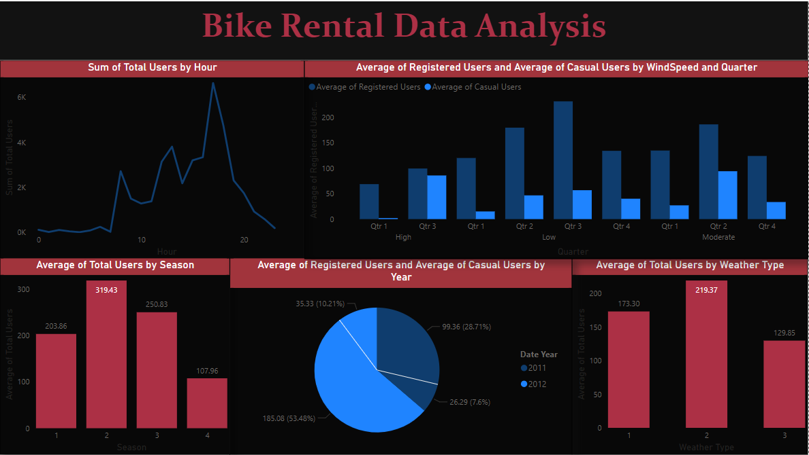

# Bike-Rental-Analysis-And-Forecasting-

This project focuses on analyzing bike rental data using Power BI for visualization and forecasting techniques like AR (AutoRegressive), MA (Moving Average), ARIMA (AutoRegressive Integrated Moving Average), and SARIMA (Seasonal ARIMA) models. The models are compared based on Mean Squared Error (MSE) to determine their accuracy.

## Data Analysis

- Utilized Power BI to create a comprehensive dashboard for visualizing bike rental data.
- Explored various metrics including rental counts, trends, user types, and more.

## Forecasting Models

Implemented the following Time Series Forecasting models:

1. **AR (AutoRegressive) Model**
2. **MA (Moving Average) Model**
3. **ARIMA (AutoRegressive Integrated Moving Average) Model**
4. **SARIMA (Seasonal ARIMA) Model**

Compared the models based on Mean Squared Error (MSE) to evaluate their accuracy in predicting future rental counts.

   

## Technologies Used

- Power BI 
- Python 
- Pandas 
- Statsmodels 

